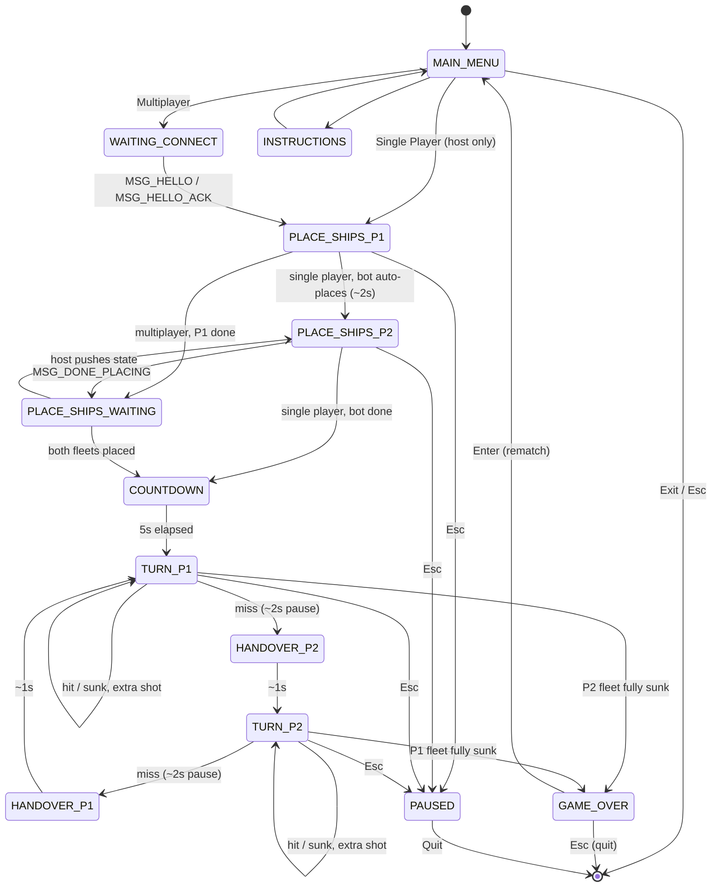

# Battleship — LCOM Project (2025/26)

A two-player Battleship game built for the **LCOM** (Laboratório de Computadores) course, on top of the course's `lcf` framework (`lcom/lcf.h`) with hand-rolled drivers for VBE video, the keyboard/mouse controller, the 8254 timer, and a 16550 UART. Two ways to play:

- **Single player** — against a "Hunt and Target" AI bot, run locally.
- **Multiplayer** — two VM instances connected over a serial cable, one launched as **host** (runs the authoritative game logic) and one as **client** (forwards input, mirrors state back).

**Authors:** Pedro Pinheiro (up202405055) · Jorge Cunha (up202405044)
**Course:** LCOM 2025/26

## Contents

1. [Overview](#overview)
2. [Architecture](#architecture)
3. [Project layout](#project-layout)
4. [Game flow](#game-flow)
5. [Single-player AI](#single-player-ai)
6. [Multiplayer and serial protocol](#multiplayer-and-serial-protocol)
7. [Controls](#controls)
8. [Key constants](#key-constants)
9. [Dependencies and environment](#dependencies-and-environment)
10. [Notes to self](#notes-to-self)

## Overview

Classic 10×10 grid, 5 ships per fleet (Carrier·5, Battleship·4, Cruiser·3, Submarine·3, Destroyer·2).

- Full mouse **and** keyboard control across every screen — menus, ship placement, attacks.
- Sprite-based rendering (XPM assets) with animated explosions and burning-ship flames.
- HUD stopwatch, hit/miss/sunk counters, and a live "garage" showing the ship currently being placed.
- One state machine drives both modes — the bot is just "player 2" as far as the FSM is concerned, handover screens and all.
- A small framed protocol over COM1 keeps two machines in sync.

## Architecture

Classic MVC split:

| Layer | Files | Responsibility |
|---|---|---|
| **Model** | `model/board.*`, `model/mouse.*`, `model/rtc.*`, `model/keyboard.h` | Grid/ship/attack rules, PS/2 packet decoding, RTC reads, KBC status bitfield |
| **View** | `view/renderer.*`, `view/game_menu.*`, `view/sprites.*`, `view/font.*` | Board/HUD drawing, menu screens + hit-testing, sprite/cursor/animation primitives, bitmap font |
| **Controller** | `controller/game.*`, `controller/bot.*`, `controller/handlers.*`, `main.*` | Central FSM, AI, IRQ-to-game glue, entry point & device init |
| **Serial** | `serial/protocol.*`, `serial/uart.*` | Message framing, 16550 UART driver (COM1 / IRQ4) |

`game.c` is the hub. Every input source — timer, keyboard, mouse, serial — funnels into a `game_handle_*` function, which mutates the single `game_t g` and calls `transition()` to move between states. `game_draw()` reads that same struct read-only, once per tick.

## Project layout

```
src/
├── assets/                        XPM art referenced via #include (not in this dump)
│   ├── explosions/                Explosion_1.xpm … Explosion_8.xpm
│   ├── flames/                    flame_1.xpm … flame_6.xpm
│   ├── ships/                     <Name>.xpm + <Name>_dead.xpm, one pair per ship
│   └── font_assets.xpm, gameBackground.xpm, logo.xpm, miss.xpm, mouse_cursor.xpm, hand_cursor.xpm
├── controller/
│   ├── bot.c / bot.h              Hunt-and-Target AI state machine
│   ├── game.c / game.h            Central game FSM (states, transitions, roles)
│   └── handlers.c / handlers.h    IRQ handlers → game_handle_* glue
├── model/
│   ├── board.c / board.h          Grid, ships, placement & attack resolution
│   ├── keyboard.h                 KBC status register bitfield
│   ├── mouse.c / mouse.h          PS/2 packet decode, cursor state
│   └── rtc.c / rtc.h              CMOS RTC read (ports 0x70 / 0x71)
├── serial/
│   ├── protocol.c / protocol.h    Message framing over UART
│   └── uart.c / uart.h            16550 UART driver (COM1, IRQ4)
├── view/
│   ├── font.c / font.h            XPM bitmap font renderer
│   ├── game_menu.c / game_menu.h  Menu screens + mouse hit-testing
│   ├── renderer.c / renderer.h    Board/HUD draw, explosion & flame animation
│   └── sprites.c / sprites.h      Sprite/cursor/animated-sprite primitives
└── main.c / main.h                Entry point, device init, role parsing
```

## Game flow

All states live in `game_state_t` (`game.h`). Host and client both walk through the *same* tags — only who owns input and who's authoritative differs (see [Multiplayer](#multiplayer-and-serial-protocol)).


*(Resume from Paused returns to whatever state you paused from — left off the diagram since it's a dynamic target, not a fixed one.)*

**Turn rule:** a hit or a sunk ship gives the same player another shot immediately; only a **miss** ends the turn. After a short pause, a "switching turns" handover screen shows for about a second before the other side goes. Single player follows this exactly — you'll briefly see a "PLAYER 2, GET READY" screen before the bot fires, even though there's no second player.

## Single-player AI

`controller/bot.c` implements a three-mode Hunt-and-Target state machine (its own, separate from `game_state_t`):

| Mode | Behavior |
|---|---|
| `MODE_RANDOM` | Attacks a uniformly random cell that hasn't been attacked yet. |
| `MODE_SEARCH_DIR` | Entered after a hit while in `MODE_RANDOM`. Probes the cells adjacent to that first hit — up, right, down, left — looking for a second hit that reveals the ship's orientation; already-explored or out-of-bounds neighbors are skipped automatically. |
| `MODE_DESTROY` | Entered once a second hit confirms an orientation. Keeps firing along that line; on a miss or the edge of the board, it jumps to the opposite side of the original hit and keeps going from there. |

Sinking a ship (`is_sunk == true`) always resets the bot straight back to `MODE_RANDOM`, whatever mode it was in. If a directional search or destroy run exhausts its attempts (4 tries) without finding the next cell, the bot also falls back to `MODE_RANDOM` — see [Notes to self](#notes-to-self).

## Multiplayer and serial protocol

Two VM instances connect over a virtual serial cable — COM1, IRQ4, 115200 8N1. One side launches as `host`, the other as `client`:

```sh
lcom_run proj "host"
lcom_run proj "client"
```

- **Host** owns the authoritative `game_t`, drives every timer-based transition, resolves attacks against the real board, runs the bot in single player, and pushes state/attack/countdown/winner updates to the client. It needs the client's ship layout in real time (to resolve attacks against it), but only reveals its own fleet to the client in one batch, right before the countdown — just enough for the client to render "sunk" sprites correctly later, without seeing host's ships mid-placement.
- **Client** owns input for symmetric, local UI (main menu, instructions, pause, game over, waiting-to-connect) plus its own ship placement and its own attack turn, mirroring those actions to the host (`MSG_SHIP_PLACE`, `MSG_ATTACK`) for authoritative resolution. Anything else — the host's turn, the host's placement phase — it just forwards raw keyboard/mouse events upstream (the `client_owns` check in `game_handle_keyboard` / `game_handle_mouse`).

Messages are framed as **1 type byte + a fixed-length payload** (`serial/protocol.h`), assembled incrementally by `proto_feed_byte()`:

| Byte | Message | Direction | Payload | Purpose |
|---|---|---|---|---|
| `H` | `MSG_HELLO` | Client → Host | — | Initiate handshake (client polls every ~1s while waiting) |
| `A` | `MSG_HELLO_ACK` | Host → Client | — | Handshake acknowledged |
| `K` | `MSG_KEY` | Client → Host | scancode | Forward a keypress the client doesn't own locally |
| `M` | `MSG_MOUSE` | Client → Host | 3-byte PS/2 packet | Forward a mouse packet the client doesn't own locally |
| `P` | `MSG_SHIP_PLACE` | Client → Host (live) · Host → Client (batched, after `MSG_DONE_PLACING`) | col, row, size, type\|orient | Mirror a ship placement |
| `T` | `MSG_ATTACK` | Client → Host (request, result=0) · Host → Client (resolved result) | col, row, result | Request an attack / report what happened |
| `C` | `MSG_CURSOR` | Bidirectional (whoever's attacking sends) | col, row | Broadcast hover cell so the opponent sees where you're aiming |
| `S` | `MSG_STATE` | Host → Client | state id | Push a new FSM state |
| `D` | `MSG_COUNTDOWN` | Host → Client | seconds | Countdown value during `STATE_COUNTDOWN` |
| `W` | `MSG_WINNER` | Host → Client | winner (1/2) | Announce the winner |
| `F` | `MSG_DONE_PLACING` | Client → Host | — | Client has placed all 5 ships |
| `Q` | `MSG_CLIENT_QUIT` | Client → Host | — | Client player quit |

## Controls

| Screen | Keyboard | Mouse |
|---|---|---|
| Main menu | ↑/↓ navigate · Enter select · Esc quit | Hover to highlight · click to select |
| Instructions | Enter or Esc → back | Click → back |
| Placing ships | Arrows move cursor · **R** rotate · Enter place · Esc pause | Move to hover · click to place |
| Your attack turn | Arrows move cursor · Enter / Space attack · Esc pause | Move to hover · click to attack |
| Paused | ↑/↓ toggle Resume/Quit · Enter select · Esc → resume | Hover to highlight · click to select |
| Game over | Enter → rematch (main menu) · Esc → quit app | — |

> Quitting from the pause menu (or main menu) notifies the other side over serial (`MSG_CLIENT_QUIT`). Quitting from game over doesn't — see [Notes to self](#notes-to-self).

## Key constants

| Constant | Value | Where |
|---|---|---|
| Board size | 10 × 10 | `BOARD_COLS`, `BOARD_ROWS` |
| Cell size / grid origin | 45 px · top-left at (290, 90) | `CELL_SIZE`, `BOARD_X`, `BOARD_Y` |
| Fleet | 5, 4, 3, 3, 2 | Carrier, Battleship, Cruiser, Submarine, Destroyer |
| Timer rate | 30 ticks/s | `TICKS_PER_SEC` |
| Pre-battle countdown | 5 s | `COUNTDOWN_START` |
| Pause before handover (on a miss) | 2 s | `POST_ATTACK_WAIT_TICKS` (60 ticks) |
| Video mode | `0x115` — 800×600, direct colour | `devices_init()` |
| Serial link | COM1, IRQ4, 115200 baud, 8N1, FIFO w/ 4-byte trigger | `uart.h` |
| RX ring buffer | 128 bytes | `UART_RXBUF_SIZE` |

## Dependencies and environment

- Reuses driver code from an individual lab folder rather than duplicating it into the project — includes like `../../../pedro/lab5/video.h` (from `controller/game.c`) or `../../pedro/lab2/i8254.h` (from `main.c`) all resolve to a `pedro/labN/` tree that sits *next to* the project's own root folder, not inside it. Moving the project without that sibling folder will break the build.
- `main()` hardcodes trace/log output paths (`/home/lcom/labs/grupo_2leic01_5/project/{trace,output}.txt`) — update these if the project ends up somewhere else.
- No build file was in what I analyzed here, so fill in the real steps once you've got them:

```sh
  # build
  TODO

  # run — two terminals / two VM instances
  lcom_run proj "host"
  lcom_run proj "client"
```

## Notes to self

- **Client disconnects aren't always reported.** Quitting from the pause menu or main menu sends `MSG_CLIENT_QUIT`, which the host handles and reacts to. Quitting from the **game over** screen (Esc) doesn't send anything — and the host's serial dispatcher has no case for `MSG_STATE` at all — so a client that leaves from game over just disappears; the host has no way to notice. Worth a look if clean disconnects matter to you.
- **The bot can lose the thread on a ship it already hit.** If `MODE_SEARCH_DIR` or `MODE_DESTROY` exhausts its probe attempts (4 tries) without finding the next cell, the bot falls back to fully random attacks instead of continuing to hunt around the known hit. Unlikely to come up often on a 10×10 board, but it's why the bot might occasionally seem to give up on a ship it already dinged.
- Single player still runs through `HANDOVER_P2` / `HANDOVER_P1` between your turn and the bot's, since it's the same host-side timing path as multiplayer — purely cosmetic, but good to know if the "GET READY, PLAYER 2" screen looks out of place against a bot.
